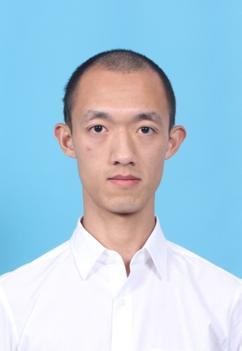

## About Me
I am currently a master student at Shanghai Jiao Tong University.
I received my bachelor degree from Huazhong University of Science and Technology.

## Research Interests
- Machine learning, spacifically the low-rank and sparse property of matrix and tensor, including models and optimization
- Deep learning in computer vision.

